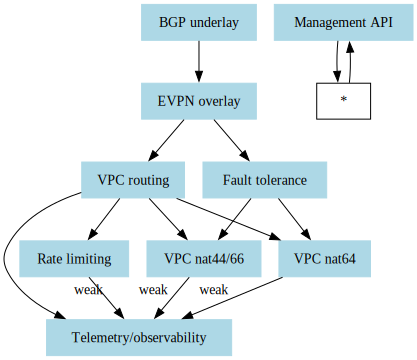
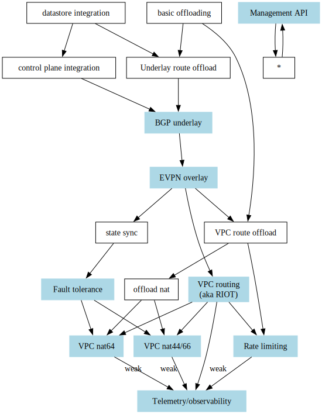

# Required features for MVP

At a very high level, these are the _user facing_ features that we require to reach MVP with the gateway:

1. BGP underlay
2. EVPN overlay
3. VPC routing (aka RIOT)
4. VPC nat 44/66
5. VPC nat 64
6. Telemetry
7. Rate limiting
8. AB fault tolerance
9. Management API

## User-facing features

> A graph of the functional dependencies between the required _user facing_ features.
> Each node on the graph represents a feature.
> No feature can be _completed_ without all of the other features which point to it.

> A _very_ high-level graph of the functional dependencies between the required features.
> Each node on the graph represents a feature.
> No feature can be _completed_ without all the other features which point to it.
> Features shown in blue are user facing.
> All other features represent internal implementation concerns.
