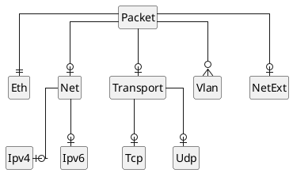

# The `net` crate

## What is `net`

[`net`] is the crate which contains all of our _software only_, _abstract_ networking logic.
This includes packet parsing and manipulation, as well as abstract implementations of network functions like routing and network address translation.

The core job of `net` is to safely and efficiently parse and manipulate **_arbitrary_ and totally untrusted** binary ingested directly from the global internet.
As such, it must be very paranoid.
Within the confines of `net`, it is acceptable (within reason) to sacrifice API ergonomics in favor of strict safety guarantees to a larger degree than would be advisable in other crates.

More, there should be no input (be it a malicious packet or invalid configuration) which should cause any function in `net` to panic or otherwise terminate the program.
`net` is our first line of defense from a security point of view, as well as a critical part of our performance profile. 
As such, `net` needs to make use of more aggressive testing and QA strategies than would typically be reasonable for such a young crate.

## How does `net` work

### Packet parsing and manipulation

`net` is mostly a wrapper around [etherparse].
Unfortunately, we can't use etherparse naively[^naively].

<aside>

[^naively]: As its name suggests, etherparse is mostly about _parsing_.
Etherparse can serialize packets and headers, but naive use of this feature doesn't really meet our requirements (see [etherparse issue #9] or [#29] for discussion).
Also, because etherparse is targeted at embedded environments, it _never_ allocates memory on the heap.
While avoiding heap allocations is a requirement for our dataplane, this also requires _[a huge amount of stack space](https://github.com/JulianSchmid/etherparse/issues/52)_ (mostly due to IPv4/6 extension headers).
Given that we expect to parse packets in large bursts (256 packets at a time would not be surprising), using 9.2kB of stack space per packet is a non-starter.
Fortunately, it was a tractable problem to wrap `etherparse`'s functionality in a way which was very suitable to our needs.
</aside>

### How the parser works

[etherparse]: https://docs.rs/etherparse/latest/etherparse/
[etherparse issue #9]: https://github.com/JulianSchmid/etherparse/issues/9
[#29]: https://github.com/JulianSchmid/etherparse/issues/29

